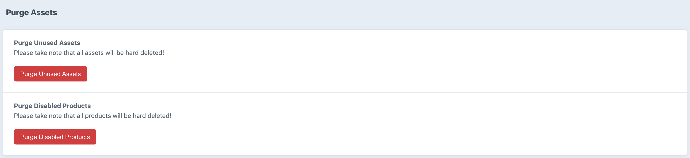

# Purge Assets plugin for Craft CMS 3.x

A plugin to purge your unused assets, disabled products, and more.

## Requirements

This plugin requires Craft CMS 3.0.0-beta.23 or later.

## Installation

To install the plugin, follow these instructions.

1. Open your terminal and go to your Craft project:

        cd /path/to/project

2. Then tell Composer to load the plugin:

        composer require BramBeekman/purge-assets

3. In the Control Panel, go to Settings → Plugins and click the “Install” button for Purge Assets.

## Purge Assets Overview

Instead of manually deleting your unused assets and disabled products, purge them with one click!

## Configuring Purge Assets

Purge Assets doesn't require some configuring, it works right away.

## Using Purge Assets

Using Purge Assets, is very simple just click the action button's in the Control Panel and lets the magic happen

You can also use console commands to purge your assets and products, just run the following command:

Purge all unused assets
`./craft purge-assets/purge/purge-unused-assets`

Purge all disabled products
`./craft purge-assets/purge/purge-disabled-products`

Take note that the assets will be soft deleted, to hard delete the assets run:

`./craft gc --delete-all-trashed`

Brought to you by [Bram Beekman](https://brambeekman.com)
